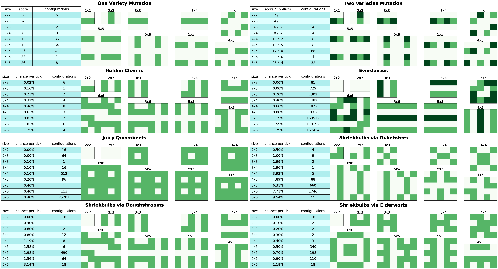

# zen_garden

This github repo solves optimal garden layouts for the cookie clicker garden.

The file garden.ipynb has the code, ui and templates for creating the infographics.

The code is written in cython, a c-compiler extention to python. The gardens are represented as [bitboards](https://www.chessprogramming.org/Bitboards) where each bit of the 64-bit integer represents a cell in the garden. Calculating the information about adjacent cells then becomes lightning fast. The solver requires the size of the garden, a reward array to optimize, and optionally (recommended) a number of neighbours to filter the results by initially. For the two-variety case, the number of neighbours to optimize for initially is required. Included in the notebook is sample executable code to solve and visualize the garden, driver code to create infographics, and a template for creating your own inforgraphics easily.

The file infographic.png is a collection of eight useful garden arrangements and some statistics for them.

The file solutions.csv caches solutions for the scan_solve method so that subsequent calls are much faster. Downloading this file is optional, but you will need to replace it with an empty csv file (with header row) or edit the code to not use cached solutions.
